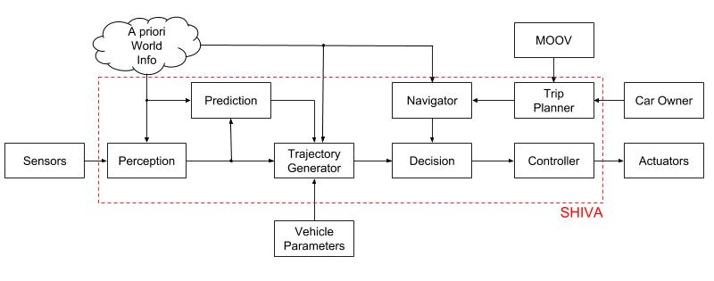
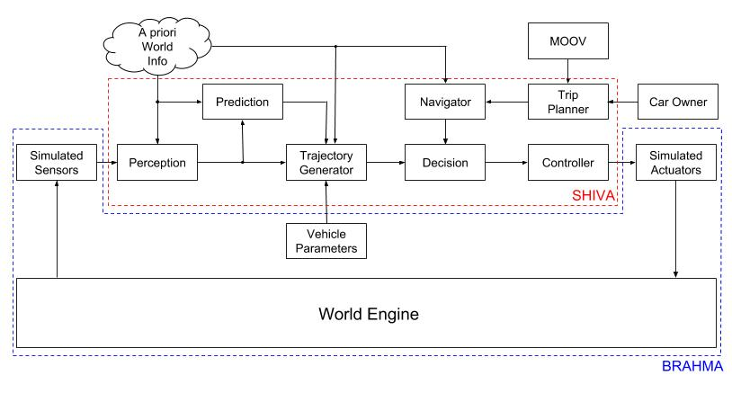
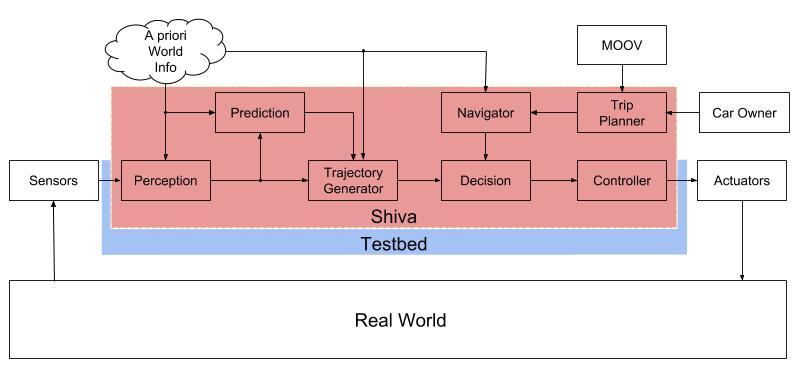
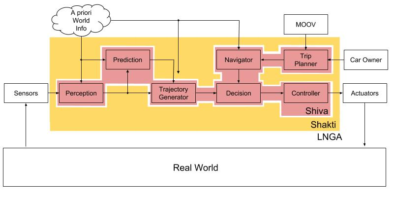

# LNGA

&nbsp;&nbsp;&nbsp;&nbsp;&nbsp;&nbsp; This document describes a self driving car chip called ‘LNGA’ which can be integrated to any car granted the car meets certain sensor and actuator requirements. The software stack running on the chip called ‘Shiva’ will power the intelligence of the self driving car. The specialized hardware ‘Shakti’ will be optimized to reliably run Shiva under minimum memory, time and energy constraints. The Shiva software mounted on the Shakti hardware will form the self driving car chip LNGA. The communication protocol between LNGA and the sensors and actuators of cars will be an open standard making it easy for car manufacturers and third party vendors to easily install it in their cars.

####The Shiva software stack
There are 13 separate modules to this stack:
- __A priori world information__
This is a predetermined 3D point cloud of the world including the road rules, location of stop signs, stop lights, speeds limits and so on.
- __Sensors__
The sensors will include:
  * Cameras
  * Radar
  * Lidar
  * GPS
  * Inertial Measurement Unit
  * Wheel Encoders
- __Perception__
The perception module is incharge of
  1. Aggregating sensor data
  2. Building a 3D point cloud
  3. Localizing the car in the world
  4. Identifying, Segmenting and Estimating position & velocity of objects relative to the car
  5. Interpreting state of stoplights
  6. Perceiving Road and Weather conditions
- __Prediction__
The prediction module is in charge of predicting the future position and velocity of the objects identified by the perception module.
- __Vehicle Parameters__
These are parameters of the vehicle including preloaded parameters like 3D model of the car, max steering angle, number of seats as well as learned parameters like brake-force model, tire slip and so on.
- __Trajectory Generator__
The trajectory generator is in charge of using the world information, perception output, prediction output and vehicle parameters to generate all the different safe trajectories available to the vehicle.
- __Trip Planner__
The trip planner is the part of the car that communicates with the car owner and understands the commands of the owner. The car owner can command the car to do things like to pick up and drop off somebody as well as to make money through the MOOV network. The trip planner will also be responsible for planning trips to charging stations when battery is low and parking the car at parking lots when not in use.
- __MOOV Interface__
This is the module that connects to the MOOV network and is in charge of picking up rides from the network.
- __Navigator__
The navigator receives the destination from the trip planner and generates a 2D route to the destination. This is similar to what google maps does today.
- __Decision__
The decision module is in charge of choosing a 3D trajectory from the trajectory generator that satisfies the 2D navigation command from the navigator with respect to safety and speed.
- __Controller__
The Controller is a cascaded set of mini controllers that converts the trajectory chosen by the decision module into velocity and steering commands that will be sent to the wheels, steering and brakes of the car.
- __Actuator__
The actuators of the vehicle are its wheels, brakes and steering shafts.
- __Car Owner__
This is the owner of the car is responsible for taking care of the car as well as setting agenda. The owner is also the direct beneficiary of all the money the car makes.

####Plan of Action
The development of LNGA will proceed in 3 steps
1. Divide Shiva into two parts, perception and processing. Define the interfaces between the two parts then individually
   * Collect test sensor data and use that develop the perception layer
   * Build a simulator, Brahma, and use that to develop processing layer
   
2. Integrate the perception and processing layers into a single software unit, Shiva, and run it on top of a testbed built using off-the-shelf hardware and software. Install this testbed inside of real cars and test it in the real world.

3. Design a custom board, Shakti, with specialized ASICS, firmware and OS to optimize Shiva for time, memory and energy constraints.

####Long Term Goals
* Add communication between vehicles to enable swarm behavior to optimize for safety, speed and efficiency.
* Add functionality to chip for driving shuttles, busses and semis.
* Add functionality for cars to democratically agree on information about the world.
######Bonus
* Port the chip for autonomous drones and use that for robots to work in tandem to deliver packages.
