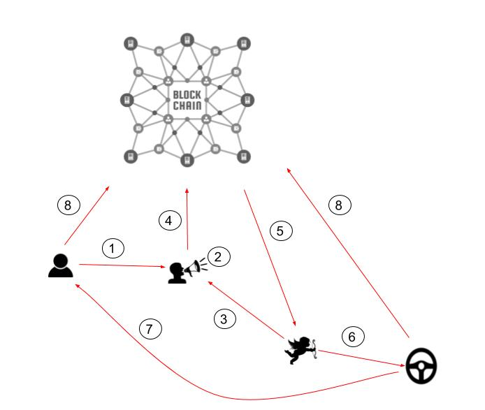

# Moov Decentralized Ride Hailing Marketplace
&nbsp;&nbsp;&nbsp;&nbsp;&nbsp;&nbsp; In yesterday’s world there were individual taxi services that coordinated rides between riders and taxi drivers. In today’s world we have Uber and Lyft, who have fully automated ride coordination but as an unfortunate consequence own the entire marketplace. Though people are paying significantly less today than they were with yesterday’s slower taxi services, this oligopolization allows Uber and Lyft to charge artificially high brokerage margins(25-40%) and not prioritize user satisfaction or new innovations.  

To dissolve this oligopoly, it is necessary to understand the different parts to Uber and Lyft. The main services offered by them can be listed as follows
1. Driver Identity checks and Vehicle Inspections.
2. Public facing servers for users and drivers to connect with each other.
3. Phone apps for drivers and riders to communicate with servers.
4. Software to match drivers and riders.
5. Software to decide the cost of a ride.
6. Payment processing and escrow.
7. Handling disputes and rider/driver reputation.

&nbsp;&nbsp;&nbsp;&nbsp;&nbsp;&nbsp; All these different services can be seen as part of a vertical, that is they are individual services dependent on each other to deliver the final ride hailing service. However it is not necessary that one entity provides all the services but by doing so the entity establishes a vertical monopoly. In an alternative scenario, if there were multiple providers in each horizontal and they competed against each other to provide their particular service at the cheapest price to their adjacent horizontals, it would be less of a monopoly. And perhaps as a consequence of tighter competition the cost of the final service maybe a lot cheaper. Is it possible to realize such a system without having to add more complexity to the life of the end user?  

&nbsp;&nbsp;&nbsp;&nbsp;&nbsp;&nbsp; We predict that in the future Uber and Lyft will be dismantled into smaller entities that will specialize in each of the services. Not only will such a change reduce number of single point of failures and strengthen the ride hailing ecosystem as a whole, the resulting tight competition will ensure that the cost of ride hailing will reduce even more over time. We want to devise an open communication protocol leveraging smart contracts to standardize the communication between these different entities. Thus reducing the need for centralization or the middle man who would charge an exorbitant amount to coordinate the actions of the various entities.  

---------------------------------------------------------------------------

#### v0.1 Simple Decentralized Ride hailing
  

&nbsp;&nbsp;&nbsp;&nbsp;&nbsp;&nbsp; This is the simplest implementation of a decentralized ride hailing marketplace as shown in the [demo](http://moovlab.online). A smart contract is hosted on the blockchain, a rider pings the smart contract with a ride request containing the pickup and dropoff location attached with the money(in protocol tokens) they are willing to pay. The smart contract authenticates the validity of a request, transfers money from the user’s account to itself and adds the ride request to queue. On the other end of smart contract, drivers are listening to the queue and the first one to accept a ride request receives it. After the driver picks up and drops off the rider at specified location, the rider will command the smart contract to release the money to the driver.  

This prototype demonstrates how a purely decentralized ride hailing service can be built without the need for any middlemen. However, there are some drawbacks.

###### User Perspective:
* Riders do not know the correct price for a particular ride, thus they are expected to take random guesses.
* Drivers cannot be pragmatically expected to sieve through the massive number of ride requests and find the one that gives them the best bang for their buck.
* There is no inherent mechanism to handle disputes between the driver and rider.   
###### Technical Perspective:
* All the interactions happen on chain, which can be very slow and inefficient.

---------------------------------------------------------------------------

#### v0.2: Uber plugged to the blockchain
  

In this improvised model a new entity has been added, the matchmaker.   
1. Riders fill a ride request with the pick up and drop off locations, authorized matchmaker, matchmaker fee(in protocol tokens) and maximum money they are willing to pay for the ride(in protocol tokens), then sign it and send it to the matchmaker.
2. When the matchmaker receives a ride request, it will match the request with the best driver based on parameters like location, rating, price etc.
3. The matchmaker will then forward the request to a driver, if the request meets the driver’s requirement, he will sign it and send it back matchmaker, who will then forward entire request to the blockchain for processing.
4. The blockchain will verify the signatures then notify the driver, then the driver will pick up the rider then drop him at specified location and notify the smart contract.
5. After the rider has been dropped, he will command the smart contract to distribute the money to the various parties as agreed.
6. However, if one of the parties files a dispute, the blockchain will kick the transaction to the matchmaker, ask it to resolve the dispute and distribute the money as it sees fit.  

Although this is a step up, it is basically Uber using the blockchain for payment processing instead of Visa or Amex. As this model scales it will likely produce monopolies due to the network effect or the winner-take-all effect. Since the probability of finding the best match is directly dependent on the number of people using a matchmaker thus it is likely to produce a few gigantic matchmakers. Consequently the barrier to entry for a new matchmaker will be high resulting in reduced competition thus hampering the process of capitalism.  

  

---------------------------------------------------------------------------

#### v0.3: Dismantled Uber

  

In this improvised model a new entity has been added, the ride manager(guy with megaphone) who is incharge of broadcasting ride requests received from riders. On the other hand, the matchmaker is only incharge of going through the ride requests broadcasted by different managers and finding the best match for its drivers. Adding the ride manager decouples the broadcasting and ride matching layers thus taking care of the network effect. As this model scales it is significantly less likely to produce oligopolies.  

  

---------------------------------------------------------------------------

#### v0.4 With integration of state authority
  

In this improvised model the government or its transportation regulating authority is also included, where it directly or indirectly(through authorized 3rd parties) enforces drivers and their vehicles to meet the safety requirements. It has to then add the the addresses of the verified drivers to a license registry hosted on the blockchain. Whenever new ride requests are sent to the chain for processing, the processing smart contract will verify that the driver address is present in the license registry. Integrating the government into the chain also allows the government to easily collect taxes to fund their invaluable services like road maintenance and emergency services.

---------------------------------------------------------------------------

#### v1.0 MOOV ride hailing marketplace

The detailed steps of the ride hailing process:

1. Rider will use the generic Moov phone app with which he can connect to any of the ride managers, while some ride managers may have their custom apps. The rider will connect with a certain ride manager and tell it where he wants to go. The ride manager will analyze current market data and respond with an estimated price and a maximum price. Through the app the rider will sign a ride request containing pickup location, drop off location, maximum price(in protocol tokens), address of the ride manager and the manager fee.
2. The ride manager will receive the request and conduct a sub second period auction for the ride request. If anybody agrees to accept the ride request at the advertised price the manager will award it to them otherwise the manager will incrementally advertise the ride request for higher prices till the maximum price indicated by the user.
3. On the other end there will be a host of matchmakers each connected to a group of drivers with authorization from the drivers to pick up a ride request on their behalf. The matchmakers will go through all the ride requests in auction and do a quick math to see if will be a good match for any one of its drivers in terms of time and money. If yes then the matchmaker will sign an accept request message containing the transaction hash of the ride request, the driver address and the matchmaker address and then send the accept request to the manager.
4. The manager will pick up the first accept request, close the auction, sign and send both requests to the smart contract hosted on the blockchain for verification.
5. If both requests are valid, that is the rider has enough money, the matchmaker has been authorized by the driver and the driver has certificate to prove he meets safety requirements, the smart contract will approve the request and move money from the rider’s account to itself. The smart contract will also send a notification to the manager and the matchmaker.
6. The ride manager will forward the notification to the rider while matchmaker will forward it to the driver.
7. Once the driver gets the notification, he will pick up and drop off the rider as per agreement and then both parties will notify the smart contract.
8. If both parties indicate to the smart contract that weren’t any issues, the smart contract will then distribute the money as agreed earlier.
9. (Conditional)However, if one of the parties raises an issue the smart contract will dispatch a dispute request to the manager and authorize the manager to distribute the money as the manager sees fit. The manager will examine the evidences, award the money to the party it judges to be the victim and receive a pre-agreed part of the disputed amount as fees for its service.

This model is more immune to oligopolization because of the proper separation of services. It is easy for the rider to move between ride managers. It is also easy for the drivers to move between matchmakers. This ease of movement and low barrier to entry will increase competition, which will reduce cost and improve quality of service overtime.

---------------------------------------------------------------------------

#### FAQ
1. Is this a decentralized or a trustless service?  
Although this model is significantly more decentralized than uber or lyft it is not a fully decentralized or a trustless service. In this model riders trust that the ride managers will be honest about the ride estimation and micro auction process. However the revenue model for the ride manager is based on loyalty, so it is of utmost importance for them that their riders do not lose trust, otherwise they could easily leave them. Similarly, drivers trust matchmakers to find the best match for them, again the revenue model for the matchmaker is also based on loyalty. So it is of utmost importance for them that their drivers do not lose trust, otherwise they could easily leave them for another provider.
2. Why do ride managers conduct micro auctions?  
Negotiating prices is usually a process that takes a lot of back and forth. Imagine multiple ride managers and matchmakers negotiating at the same time, it could become a very noisy process. But by making the ride managers conduct micro auctions, the number of interactions between the manager and matchmaker is minimized.
3. How are the fees for manager and matchmaker allocated?  
Usually a manager will specify a flat fee to host a ride request and specify a percentage cut of the disputed amount if it has to resolve disputes. On the other end, matchmakers will specify a percentage cut to drivers for finding them the best match.

---------------------------------------------------------------------------

#### Open source tools

We will develop a suite of open source software that will make it easy for developer to launch ride manager and matchmaker services. This suite of software will include
1. An open source version of the ride manager.
2. An open source version of the phone app riders will use to connect with the ride manager.
3. An open source version of a data aggregator which will collect current ride request data and builds a real time heat map.
4. An open source version of a machine learning algorithm that mines through the aggregated ride request data and predicts future ride requests heat map.
5. An open source version of a AI credit rater which goes through the trove of available information and gives each rider and driver a rating.
6. An open source version of the matchmaker which will use 3, 4 & 5 in conjunction with its internal AI software to find the best matches for its drivers.
7. An open source version of the app drivers will use to connect with the matchmaker.  
All these open sourced tools will significantly lower the entry for anyone to become one of the service providers in our ecosystem, thus increasing the adoption rate of our protocol.

---------------------------------------------------------------------------

#### Long Term Goals
- Support for pooling
- Support for scheduled rides
- Support for multi transit rides
- Support for integrating with public transit
- Support for moving goods like food, laundry, mail
