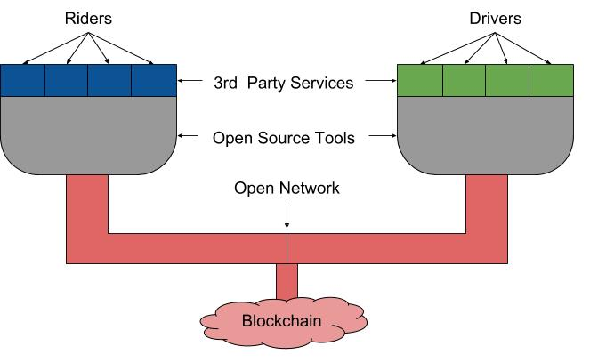

# MOOV Business Plan
The goals of the Moov organization are to
1. Decentralize ride hailing market
2. Open source self driving car technology

#### Why?
So our customers can save money by not having to
- Pay a central entity, like Uber, high commission to find rides.
- Pay owners of self driving car technology, like Waymo, to use autonomous cars.

&nbsp;&nbsp;&nbsp;&nbsp;&nbsp;&nbsp; Fulfillment of these goals will also stabilize the ride hailing ecosystem by distributing power  more proportionately among the market entities. For example, today Uber wields too much power in setting price for riders and wages for drivers but in a decentralized system both parties will have autonomy in setting their own prices.  
&nbsp;&nbsp;&nbsp;&nbsp;&nbsp;&nbsp; Decentralizing ride hailing is akin to bitcoin which decentralized banking institutions by allowing people to securely transfer money to each other without needing to go through a middle man. Open sourcing self driving car technology is akin to FreeBSD or Linux which open-sourced operating systems. Most of the internet today is running on these freely available operating systems, if it wasn’t for them the internet services we use everyday would be costing us a lot more.

Lot of people will probably agree that these are good and noble goals but how is it possible to fund such an expensive endeavor? The answer is “by leveraging the token model.”

#### Token Model?
A token is similar to stamp, for instance stamps are used today to move mail from one part of the world to another. In an alternative system a token can be used to move mail from one part of the world to another. However there is one key difference betweens tokens and stamps, tokens are limited in number and are therefore reusable, this limitedness is what makes them so powerful.

In the stamp model:
1. Post office prints stamp,
2. Users buy stamp from post office
3. Users affix stamp to their mail and drop it at post office
4. Post office verifies and voids stamp
5. Post office forwards the mail to it’s salaried mailman
6. Mailman drops mail at the indicated location.

In the token model, there isn’t a centralized authority like a post office that mints tokens and controls the number of tokens in circulation, instead there is already a limited number of tokens in circulation.
1. Users buy tokens from exchanges
2. Users affix token to their mail and drop it at post office
3. Post office verifies the token
4. Post office forwards both mail and token to unsalaried mailman
5. Mailman drops off mail at the indicated location
6. Mailman then sells the token at exchanges to other people who want to send mail.

In actuality the post office in this model is a computer program running on a decentralized network of computers that is in charge of forwarding mail and transferring tokens. The benefit of this model is that ownership of the network is fully decentralized meaning there is not a central entity transferring funds, collecting commissions or setting prices. Instead it is a completely free market and the price of mailing is directly dictated by supply and demand which will inevitably result in customers paying the lowest cost possible.

#### Putting it all together
Instead of using tokens to transport mail, we will transport people. A demo of this idea is hosted [here](http://moovlab.online). In this demo you can pretend to be a customer and use tokens to move from one part of the simulated world to another.
1. First you will have to buy a few tokens from a mock exchange,
2. Then you will have to make a ride request with pick up and drop off locations
3. You will also have to attach to the request how many tokens you are willing to pay.
4. Then you will have to send the request to a decentralized ride coordinating smart contract(akin to Uber) hosted on the Ethereum virtual machine.
5. The smart contract will record necessary information, hold the tokens and forward the request to the network of self driving cars in the simulator.
6. The self driving cars will evaluate the request and the first one to accept will be awarded the ride by the smart contract.
7. Then the car will pick you and drop you off as per your request
8. Then you will hopefully ask the smart contract to release the money to the self driving car.

There are three main parts to this demo.
1. __Full Automation__, there is not a single human in this loop either in the ride coordinating or the driving areas. The realization of this will be a monumental human feat however that is an inevitable reality, the real victory for our customers is in the next two parts.
2. __Decentralized Ride Hailing__, No central entity like Uber owns the ride hailing network it is rather hosted on a decentralized network of computers communicating through [open protocols](https://github.com/Moov-Organization/demo2/blob/master/truffle/contracts/MoovRideManager.sol). This means our customers do not have to pay a commission to any middlemen.
3. __Open source self driving car technology__, the self driving technology is [open sourced](https://github.com/Moov-Organization/demo2/blob/master/go-packages/sim2/car.go) and consequently anybody can use the code to launch their own self driving car. Since potential self driving car owners do not have to pay an entity like Waymo for the technology to launch a self driving car, their barrier to entry is drastically reduced. That will result in increased competition which will result in reduced costs for our customers.

However the environment today, with respect to technology, is not readily conducive to the realization of such a system, therefore we will have to move in incremental steps.

#### Market Analysis
&nbsp;&nbsp;&nbsp;&nbsp;&nbsp;&nbsp; With about 10% of the American population as active users, Uber’s total revenue for the year 2017 was 37 billion dollars. After the introduction of self driving cars America is touted to become a passenger economy. In that case, a significant portion of the remaining 90% of the population will be using ride hailing services instead of owning cars. According to a study published by intel, ride hailing economy is posited to be worth 400 billion dollars per year in 15 years and [3.7 trillion dollars per year in 30 years.][1]  
&nbsp;&nbsp;&nbsp;&nbsp;&nbsp;&nbsp; When customers make ride requests through our platform they will specify the ride amount in tokens instead of dollars. For example, if the exchange rate for the tokens is one dollar per token and a ride costs about 5 dollars, then the customer will be expected to pay five tokens.
In the naively optimistic case, if our platform were to completely replace Uber as it stands today, then the transactional load per year on the tokens would be 37 billion dollars. And in thirty years if our platform is the de facto standard to summon rides, then transactional load per year on the tokens could be 3.7 trillion dollars. Again these are huge “ifs” but that is the market potential available for the adoption of our platform. Big corporations like Waymo, Uber, GM, Ford and others have realized the profitability of this market and have already invested more than [80 billion dollars][2].  
&nbsp;&nbsp;&nbsp;&nbsp;&nbsp;&nbsp; Now if we are able to successfully decentralize the ride hailing marketplace, that is reduce the middlemen and therefore significantly reduce the [25% commission][3] that Uber tacks on to every ride. And at the same time if we are able to provide a quality of service on par or better than Uber, then there is a good chance we can succeed. Self driving cars are going to completely disrupt ride hailing, so if we can make self driving technology exclusively available to customers of our network for free then that will also massively increase the chances of our success.

#### The Overarching Plan
1. Issue a limited number of utility tokens and sell it to our customers with the promise that at some point in the future they will be able to use the tokens to move from one part of the world to another at a cheaper cost than our competitors.
2. Use the money to build a decentralized ride hailing market place that our customers can use to connect with human and nonhuman drivers
3. Use the money to build out self driving car technology under a limited open source license that will make it freely accessible only to our customers which will incentivize the adoption of our ride hailing network. In the long run, after our network has succeeded in winning over the majority of the market, then we will make the technology completely open sourced.

#### Milestones
1. Build a decentralized alternative to Uber, with apps for drivers that optimizes for maximum wage per hour and tells them exactly where to go and whom to pick. Build an app for our customers with which they can easily find rides.
2. Develop a chip that can virtually make any car into a self driving car and readily work with the platform built in milestone 1.

##### Milestone 1: Decentralized Uber (MOOV network)
&nbsp;&nbsp;&nbsp;&nbsp;&nbsp;&nbsp; Nobody owns the Internet today because it is built on open protocols for computer to computer communication which developers use to build applications. Similarly we will develop open protocols for riders and drivers to communicate which developers will use to build services. We will also build a host of open source tools that will allow developers to easily build out their services. In the figure below, we will build the red and gray layers, whereas third party developers will build the blue and green layers, rider services and driver services respectively. Riders and Drivers will connect to the network through these services.

&nbsp;&nbsp;&nbsp;&nbsp;&nbsp;&nbsp; There are multiple reasons for this architecture. The reason Uber is harmful for the ride hailing ecosystem is that they have complete ownership of the network, therefore they have full liberty in setting prices and seeking commissions. To prevent abuse of of such control we propose to decentralize ownership of the network by standardizing communication which will create a platform for developers to build services. And since none of the services would have a monopoly over the traffic of the network, it will lead to tight competition among them which will result in production of quality services at reduced cost to drivers and riders. This is in stark contrast to ride hailing today, that is if riders are unhappy with Uber and they switch to Lyft then they lose contact to all of Uber’s drivers. Whereas in our proposed solution if a rider is unhappy with one provider and switches another, they still have access to the entire pool of drivers. The development of open source tools for service providers will reduce costs for developers which will directly result in more money saved by end users.
More details regarding the open protocols and open source tools can be found [here](marketplace.md)

###### Scalability
&nbsp;&nbsp;&nbsp;&nbsp;&nbsp;&nbsp; With 75 million active users, Uber powered about 4 billion rides in the year 2018, that is averaging about [130 rides per second][4]. Our demo is hosted on the Ethereum blockchain which can handle only about 15 transactions per second, not to forget there are hundreds of other applications competing for a slice of this transaction throughput. Therefore Ethereum blockchain as it stands is grossly insufficient to handle our transaction requirements. As more people are inducted into the transportation as a service market, our transaction requirements may reach up to several thousand per second. So we are tasked with finding a blockchain technology that can meet such a requirement.  
&nbsp;&nbsp;&nbsp;&nbsp;&nbsp;&nbsp; Ethereum is slow today, however with the introduction of Proof Of Stake, Sharding and complemented by Plasma for specialized services it is projected to increase its transaction throughput by orders of magnitude. However, only time will tell if it will be enough to meet our requirements. There are also other blockchains on the rise like Dfinity and Maidsafe who are promising faster transactions per second. With more than several hundred billion dollars pumped into the blockchain market within the last year and virtually all blockchain services bottlenecked by scalability, it is a reasonable bet that somebody will solve the scalability issue within the next couple of years. In the worst case scenario, till a scalable decentralized blockchain is invented we can roll out our own quasi decentralized blockchain based on XRP(Ripple). Ripple has been shown to handle up to [50,000 thousand transactions per second][5] which would be more than enough for our needs. Although the block validation method(Cooperative Consensus) would not be fully decentralized it would still be a huge step up from Uber as there wouldn’t be a single node that has full control over the network.

##### Milestone 2: Free self driving car technology
&nbsp;&nbsp;&nbsp;&nbsp;&nbsp;&nbsp; The reality of the matter is that even if a new alternative to Uber were to pop up tomorrow and charge 0% commission instead of Uber’s 25%, it still would not be able attract drivers from Uber. This is because the value of Uber lies is in its traffic of 75 million active users. So if a company has to succeed in luring away drivers from Uber, they have to offer something that is significantly better than the opportunity cost. How about free self driving car technology? We plan to develop self driving car technology and offer it for free exclusively to drivers(car owners) who agree to use our network. This will be a deal most people cannot refuse because they would get free self driving car technology to use a ride hailing network that charges negligible commission. Once our network has been adopted by most of the drivers we will be in the advantageous position Uber is in today and then we will completely open our self driving car technology to all people. And in the end we will all be left with a network and self driving car technology that is not owned by a single entity which would result in minimum transportation cost to our customers. More information regarding the development plan for the self driving car can be found [here](avStack.md).

#### Token Allocation
Total Tokens: 10 billion  
Accredited Investors: 250 million at 25 cents per token in July 2018  
Accredited Investors: 500 million at 50 cents per token in July 2019  
Accredited Investors: 1.5 billion at 75 cents per token in July 2020  
Public Coin Offering: 5.0 billion at 1 dollar per token in July 2021  
Early Adopters: 1.5 billion for free July 2020 to July 2024  
Employees: 1.5 billion in proportion to their salaries from 2018 to 2028  

#### Timeline
July 2019: Launch alpha version of MOOV and demo 3D simulator with autonomous cars connected to MOOV performing ride sharing.  
July 2020: Launch beta version of MOOV and demo real cars performing ride sharing connected to MOOV in a controlled environment  
July 2021: Launch production version of MOOV and demo real cars performing ride sharing connected to MOOV in an urban environment.  
July 2022: Demo cars performing more sophisticated maneuvers in urban environments and the alpha version of the self driving computer chip, LNGA.  
July 2023: Demo LNGA, the computer chip that can make any car into self driving car. Partner with chip manufacturers to setup production. Partner with auto manufacturers to integrate chips into their cars.  
July 2024: Get safety certification of LNGA from ISO, VSC and other leading safety certifiers. Get approval from federal and state level regulators to install LNGA in cars.  
July 2025: Start selling self driving cars with LNGA installed in them.  

MOOV alpha version: Demonstrating the open protocols and open source tools  
MOOV beta version: Demonstrating scalable blockchain solution  
LNGA alpha version: Custom PCB using FPGAs, micro controllers and off the   shelf RTOS.  

> @todo Legal Compliance  
> @todo Governance

[1]: https://newsroom.intel.com/news-releases/intel-predicts-autonomous-driving-will-spur-new-passenger-economy-worth-7-trillion/
[2]: https://www.brookings.edu/research/gauging-investment-in-self-driving-cars/
[3]: https://www.ridester.com/uber-fees/
[4]: https://www.recode.net/2018/1/5/16854714/uber-four-billion-rides-coo-barney-harford-2018-cut-costs-customer-service
[5]:  https://globalcoinreport.com/ripple-for-the-future-visa-transactions-speed-outclassed-by-xrp/
