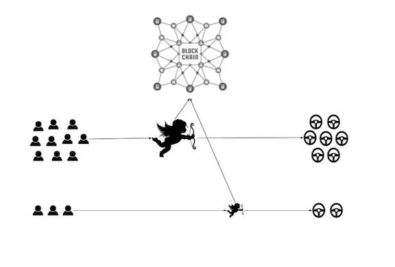
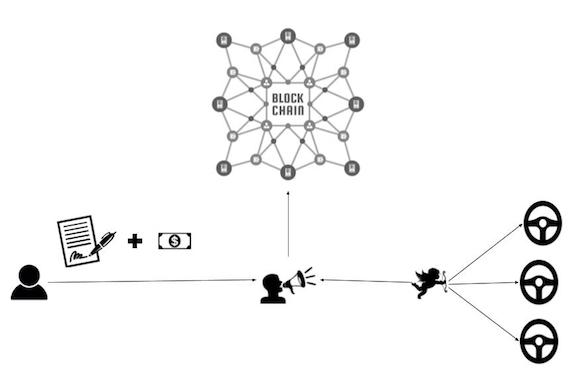
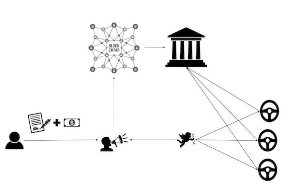

# Moov Ride Hailing Whitepaper

> @todo merberich
> I think this content deserves a hard edit before it goes live. For now, this is just a copy of the documentation as it exists on Google Drive.

> This documentation is not finalized and may undergo significant rework.

## Introduction: An Overview of Transportation

Transportation is essential to modern living.

> @todo formulate these points into a cohesive intro
- personal transportation
  - expensive: vehicle cost, insurance, fuel, maintenance
  - inefficient for most cases: sits in parking lot, high downtime, takes up space
- public transportation
  - improved space efficiency, only inactive after servce time is up
  - typically improves cost efficiency if a ride plan is purchased
  - fixed routes along centralized paths, no way to connect fringe locations
  - strict timing means planning around transportation, rather than the other way around
- taxi services
  - resolves time efficiency by providing transportation-on-demand
  - often expensive
  - hard to break in to the market, monopolies/oligopolies form
- user-owned manned fleets
  - easier to enter market as a provider
  - retain space and time efficiency of transportation service model
  - suffer from lack of unified information system
- ride hailing systems (Uber + Lyft + Waymo)
  - retain space and time efficiency of transportation service model
  - users cannot set their own rates
  - with development of autonomous vehicles, human drivers will be replaced
  - oligopoly on best performing fleet
- public distributed ride hailing system with user-owned manned fleets
- public distributed ride hailing system with autonomous fleets

Overall, review benefits of [Transportation as a Service](https://en.wikipedia.org/wiki/Transportation_as_a_Service) model, then transition into:

> @todo the statement below require heavy citation of sources incidating increasing autonomous vehicle saturation of roads

... Specifically, we worry that in transitioning from Uber and Lyft's user-owned but centrally-stewarded TaaS to a TaaS operated by autonomous fleets, public vehicle providers lose the ability to compete in the market. With a select few companies owning larger and larger percentages of vehicles on the road, this could result in an oligopoly.

> @todo follownig par needs revision; succinct and unambiguous description of proposal

However, a more ideal form of transportation system ownership may logically exist beyond today's current ride-hailing system, which would be able to seamlessly evolve into a publicly-owned autonomous fleet system. We propose a decentralized, public-stake ride-hailing and car ownership system. To understand the nuances of this proposed system, we must break down what today's ride-hailing services provide.

~~In yesterday’s world there were individual taxi services that coordinated rides between riders and taxi drivers. In today’s world we have Uber and Lyft, who have fully automated ride coordination but as an unfortunate consequence own the entire marketplace. Though people are paying significantly less today than they were with yesterday’s slower taxi services, this oligopolization will allow Uber and Lyft to charge artificially high brokerage margins and not prioritize user satisfaction or new innovations.~~

## Background: Services Supporting Transportation

> @todo rephrase, but basically this

To dissolve this oligopoly, it is necessary to understand the different parts to Uber and Lyft. The main services offered can be listed as follows:
- Driver Identity checks and Vehicle Inspections.
- Public facing servers for users and drivers to connect with each other.
- Phone apps for drivers and riders to communicate with servers.
- Software to match drivers and riders and perform price point negotiation.
- Software to decide the cost of a ride.
- Payment processing and escrow.
- Handling disputes and rider/driver reputation.

~~All these different services can be seen as part of a vertical, that is they are individual services dependent on each other to deliver the final ride hailing service. However it is not necessary that one entity provides all the services but by doing so the entity establishes a vertical monopoly. In an alternative scenario, if there were multiple providers in each horizontal and they competed against each other to provide their particular service at the cheapest price to their adjacent horizontals, it would be less of a monopoly. And perhaps as a consequence of tighter competition the cost of the final service maybe a lot cheaper. Is it possible to realize such a system without having to add more complexity to the life of the end user?~~

> @todo this is wishful thinking written; instead explain how a natural evolution could happen based on intro

~~We predict that in the future Uber and Lyft will be dismantled into smaller entities that will specialize in each of the services. Not only will such a change reduce number of single point of failures and strengthen the ride hailing ecosystem as a whole, the resulting tight competition will ensure that the cost of ride hailing will reduce even more over time. We want to devise an open communication protocol leveraging smart contracts to standardize the communication between these different entities. Thus reducing the need for centralization or the middle man who would charge an exorbitant amount to coordinate the actions of the various entities.~~

> @todo continue editing below this line:
> - design decisions could use trimming
> - reduce size of images, use XML-generated images from something like draw.io
> - revise v1.0 for service-oriented descriptions and make sure new system jives
> - consider removing sections below v1.0 section; extraneous or should be moved to business/values doc

> - cut down on content in v0.1-0.4 and move info to rebuttals section(s)
> - provide user-friendly blog as intro to tech, hand-holding
> - provide counterarg + rebuttal after v1.0 proposal section
----

## Design Decisions Background

### Simple Decentralized Ride hailing (v0.1)

This is the simplest implementation of a decentralized ride hailing marketplace as shown in the demo. A smart contract is hosted on the blockchain, a rider pings the smart contract with a ride request containing the pickup and dropoff location attached with the money(in protocol tokens) they are willing to pay. On the other end of smart contract, drivers are listening to the queue of ride requests and the first one to accept a ride request receives it. After the driver picks up and drops off the rider at specified location, the rider will command the smart contract to release the money to the driver.

This prototype demonstrates how a purely decentralized ride hailing service can be built without the need for any middlemen. However, there are some drawbacks.

User Perspective:
- Riders do not know the correct price for a particular ride, thus they are expected to take random guesses.
- Drivers cannot be pragmatically expected to sieve through the massive number of ride requests and find the one that gives them the best bang for their buck.
- There is no inherent mechanism to handle disputes between the driver and rider.

Technical Perspective:
- All the interactions happen on chain, which can be very slow and inefficient.

### Uber Plugged In to the Blockchain (v0.2)

In this model a new entity has been added, the matchmaker. Riders fill a ride request with the pick up and drop off locations, authorized matchmaker, matchmaker fee(in protocol tokens) and maximum money they are willing to pay(in protocol tokens), then sign it and send it to the matchmaker. When the matchmaker receives a ride request, it will match the request with the best driver based on parameters like location, rating, price etc. The matchmaker will then forward the request to a driver, if the request meets the driver’s requirement, he will sign it and send it back matchmaker, who will then forward entire request to the blockchain for processing. The blockchain will verify the signatures then notify the driver, after the driver picks up and drops off the rider at specified location, the rider will command the smart contract to distribute the money to the parties as agreed. However, if there is a dispute, the blockchain will kick the transaction back to the matchmaker and ask it to resolve the dispute.
Although this is a step up, it is basically Uber using the blockchain for payment processing instead of Visa or Amex. As this model scales it will likely produce monopolies due to the network effect or the winner-take-all effect. Since the probability of finding the best match is directly dependent on the amount of traffic flowing through the matchmaker, it is likely for a few matchmakers to become too big. Consequently the barrier to entry for a new matchmaker will be high resulting in reduced competition thus hampering the process of capitalism.

### Dismantled Uber (v0.3)

In this model a new entity has been added, the ride manager(guy with megaphone) who is incharge of broadcasting ride requests received from riders. On the other hand, the matchmaker is only incharge of going through the ride requests broadcasted by different managers and finding the best match for its drivers. Adding the ride manager decouples the broadcasting and ride matching layers thus taking care of the network effect. As this model scales it is significantly less likely to produce oligopolies.

### With Integration of State Authority (v0.4)

In this model the government or its transportation regulating authority is also included, where it directly or indirectly(through authorized 3rd parties) verifies drivers and their vehicles for meeting the minimum safety requirements. It has to then add the the addresses of the verified drivers to a license registry hosted on the blockchain. Whenever new ride requests are sent to the chain for processing, the processing smart contract will verify that the driver address is present in the license registry. Integrating the government into the chain also allows the government to easily collect taxes to fund their invaluable services like road maintenance and emergency services.

## Ride Hailing Protocol Version 1
> @todo populate with new info
> @todo this protocol needs a proper name

The detailed steps of the ride hailing process:

1. Rider will use the generic Moov phone app with which he can connect to any of the ride managers, while some ride managers may have their custom apps. The rider will connect with a certain ride manager and tell it where he wants to go. The ride manager will analyze current market data and respond with an estimated price and a maximum price. Through the app the rider will sign a ride request containing pickup location, drop off location, maximum price(in protocol tokens), address of the matchmaker and the matchmaker fee
2. The matchmaker will receive the request and conduct a subsecond period auction of the ride request. If anybody agrees to accept the ride request at the advertised price the manager will award it to them otherwise the manager will incrementally advertise the ride request for higher prices till the maximum price indicated by the user.
3. On the other end there will be a host of matchmakers each connected to a group of drivers with authorization from the drivers to pick up a ride request on their behalf. The matchmakers will do a quick math to see if a ride request will be a proper match for any one of its drivers in terms of time and money, if yes then the matchmaker will sign an accept request message containing the transaction hash of the ride request, the driver address and the matchmaker address and then send the accept request to the manager.
4. The manager will pick up the first accept request, close the auction, sign and send both requests to the smart contract hosted on the blockchain for verification.
5. If both requests are valid, that is the rider has enough money and the matchmaker has been authorized by the driver, the smart contract will approve the request and move money from the rider’s account to itself. The blockchain will also send a notification to the manager and the matchmaker.
6. The matchmaker will forward the notification to the driver.
7. Once the driver gets the notification, he will pick up and drop off the rider as per agreement and then both parties will notify the smart contract.
8. If both parties indicate to the smart contract that weren’t any issues, the smart contract will then distribute the money as agreed earlier.
9. (Conditional)However, if one of the parties raises an issue the smart contract will dispatch a dispute request to the manager and authorize the manager to distribute the money as the manager sees fit. The manager will examine the evidences, award the money to the party it judges to be correct and take a part of the disputed amount as fees for the service of handling the dispute.

This model is more immune to oligopolization because of the proper separation of services. It is extremely easy for the rider to move from one ride manager to another. The barrier to entry for a new manager or a new matchmaker is extremely low. It is also easy for the drivers to move between matchmakers. This ease of movement and low barrier to entry will increase competition, which will reduce cost and improve quality of service overtime.

### FAQ

1. Is this a decentralized or a trustless service?

Although this model is significantly more decentralized than uber or lyft it is not a fully decentralized or a trustless service. In this model riders trust that the ride managers will be honest about the ride estimation and micro auction process. However the revenue model for the ride manager is based on loyalty, so it is of utmost importance for them that their riders do not lose trust, otherwise they could easily leave them. Similarly, drivers trust matchmakers to find the best match for them, again the revenue model for the matchmaker is also based on loyalty. So it is of utmost importance for them that their drivers do not lose trust, otherwise they could easily leave them for another provider.

2. Why do ride managers conduct micro auctions?

Negotiating prices is usually a process that takes a lot of back and forth. Imagine multiple ride managers and matchmakers negotiating at the same time, it could become a very noisy process. But by making the ride managers conduct micro auctions, the number of interactions between the manager and matchmaker is drastically minimized.

3. How are the fees for manager and matchmaker allocated?

Usually a manager will specify a flat fee to host a ride request and specify a percentage cut of the disputed amount if it has to resolve disputes. On the other end, matchmakers will specify a percentage cut to drivers for finding them the best match.

4. How are drivers and vehicles enforced to meet minimum safety requirements?

This will be addressed in the next version.

### Scalability

Even though this a significantly better model than the current one for ride hailing services, it cannot be realized till there are scalable implementations of the blockchain. On average Uber dispatches about 150 rides every second whereas today’s top smart contract service provider, the ethereum virtual machine, can only process about 15 transactions per second. Not to forget, there are thousands of other smart contracts competing for transaction space within the ethereum virtual machine. As the passenger economy enlarges over the coming years, there may be several thousand ride requests per second. As of now there is not a decentralized blockchain out there that can meet such a demand. So that is the risk we face and we are betting that within a few years a scalable blockchain that can meet our transactional requirements will be available. If that is not the case, we are not opposed to developing a chain that is tailored to our needs.

### Market Analysis

When riders make a ride request, they will specify the ride amount in dollars but since the blockchain does not have an inherent understanding of dollars, the dollar amount will be converted to a protocol token, called Moov tokens. With about 10% of the American population as active users, uber’s total revenue for the year 2017 was 37 billion dollars. If the protocol mentioned above was used instead, the transactional load per year on the protocol tokens would have been 37 billion dollars. America is touted to become a passenger economy over the next few decades. If that is the case, significant portion of the remaining 90% of the population will be using mobility as a service instead of owning cars. According to a study published by intel, ride hailing economy is posited to be worth 400 billion dollars per year in 15 years and 3 trillion dollars per year in 30 years. So if Moov protocol becomes the standard protocol to make rides in the future, the transactional load on the protocol tokens maybe billions or trillions of dollars per year.

### Our Plan

We plan to issue a limited number protocol tokens and sell them as utility tokens. We will use the money to develop the Moov smart contract which will enable the Moov ride hailing protocol showcased above. Not only that we will also develop a suite of open source software that will incentivize the adoption of the Moov protocol. This suite of software will include:
1. An open source version of the ride manager.
2. An open source version of the phone app riders will use to connect with the ride manager.
3. An open source version of a data aggregator which will collect current ride request data and builds a real time heat map.
4. An open source version of a machine learning algorithm that mines through the aggregated ride request data and predicts future ride requests heat map.
5. An open source version of a AI credit rater which goes through the trove of available information and gives each rider and driver a rating.
6. An open source version of the matchmaker which will use 3, 4 & 5 in conjunction with its internal AI software to find the best matches for its drivers.
7. An open source version of the app drivers will use to connect with the matchmaker.

All these open sourced tools will significantly lower the entry for anyone to become one of the service providers in our ecosystem, thus increasing the adoption rate of our protocol.

### The "Kicker"

That is not all the technology we plan to develop that will increase the adoption of the Moov protocol, we also plan to develop open source self driving technology. This technology will be open under a limited license where the source code will be open and individuals can use it for personal use for free. However if they want to use the technology for commercial purposes(make money using it) they will have apply for a commercial license. The commercial license will be granted on an agreement along the lines of:
“Licensed parties may use the software to offer taxi services commercially and if they use the Moov network they can keep all the money they make to themselves. However, if they chose to use another ride hailing network or use it for commercial purposes other than taxi services then they will have to donate a portion of the money to an open source project of our choosing.”

We plan to develop a logic board that will enable any vehicle to become a self driving vehicle granted the sensors and actuators of the vehicle meet specified requirements and interface with the board using specified protocols. We will also get this board safety certified by the top safety certifying companies in the world. We will then partner with car manufacturers from around the world to install this board in their vehicles. There would be incentive for them to partner with us because we would giving them the ability to add safety certified self driving capabilities to their cars for almost free. They would only have to pay for the cost of manufacturing the board. This reduction in cost will directly be translated to the end consumers (especially the drivers who depend on driving as a livelihood) to easily afford a self driving car.

This board and it’s commercial license will be critical in the increasing the adoption of the protocol and funding the development of more open source projects.

Again we plan to fund the development of the protocol and the suite of technology aimed at increasing its adoption through the sale of the limited number of protocol tokens. In the future, these protocol tokens will be used as utility tokens by riders to move from one part of the world to another.

> @todo determine what other sections need to be here
